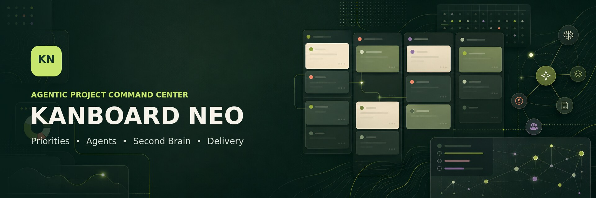
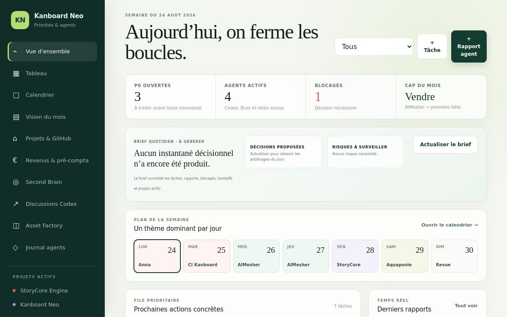
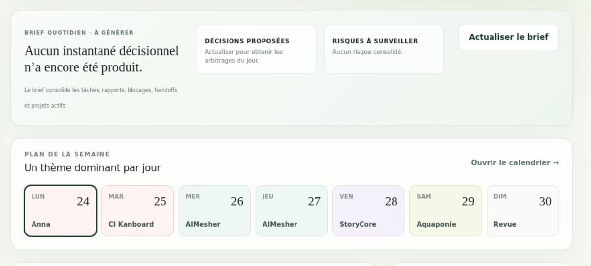

<p align="center">
  
</p>

<h1 align="center">Kanboard Neo</h1>

<p align="center">
  An agentic project command center for priorities, AI workers, knowledge, delivery and business operations.
</p>

<p align="center">
  <a href="LICENSE"></a>
  
  
</p>

> [!IMPORTANT]
> **Repository transition:** the documentation below describes the deployed Kanboard Neo v27 private preview; the current screenshots show the v25 dashboard before the artistic-projects and marketing tabs were added. This repository still contains its historical Kanboard base while the new agentic codebase is migrated in controlled milestones. Do not treat the current `main` branch as a ready-to-install v27 package yet.

## Why Kanboard Neo?

Most kanban tools only record tasks. Kanboard Neo also records who—or which AI agent—owns the work, who joined as reinforcement, what was actually received and started, which evidence proves completion, how much the execution cost, and what should happen next.

It is designed as a shared operating surface for a human owner, Codex, local agents and specialized runtimes without letting orchestration replace security, policy enforcement or verified execution.

## Current capabilities

| Area | What Kanboard Neo provides |
| --- | --- |
| Priorities | P0/P1/P2 queues, drag-and-drop planning, due dates, next actions and monthly visibility |
| Agent delivery | Atomic claim, reinforcement, durable `sent → received → started → completed/blocked` receipts, leases and heartbeats |
| Odin orchestration | `odin-codex` handoffs, bounded concurrency, watchdogs, retries, circuit breakers and independent review gates |
| Model routing | Local-first routing, free-provider discovery, quota/credit awareness, time-window scheduling and bounded fusion mode |
| Daily decisions | Portfolio brief, proposed decisions, risks, blockers, weekly focus and active-project signals |
| Projects & GitHub | Active-project registry and idempotent repository import without silently deleting missing repositories |
| Artistic projects | Dedicated portfolio for StoryCore, BD/webtoon, Zed Giller Musics, the book, Monstericor and physical creations, linked to tasks and Asset Factory outputs |
| Marketing & community | Campaigns, channel tracking, approval-gated editorial queue and reusable content planning for X, YouTube, Reddit, Discord and optional platforms |
| Ultimate Odycer onboarding | Preconfigured client projects sourced from the five public UltOd client templates, including compatibility gates, media tasks, community channels and a draft launch campaign |
| Second Brain | Knowledge inbox, source provenance, Obsidian navigation, backlinks, anti-duplicate checks and quick indexes |
| Research | Whiteboards, moodboards and a benchmarkable k-NN use-case registry for Fovea Engine, Ultimate Odycer and other projects |
| Asset Factory | Project assets linked to tasks, Codex discussions, provenance and delivery status |
| Business operations | Offers, entitlements, B2B SaaS billing preparation, leads, LLM/electricity costs, equipment amortization and purchasing forecasts |

## Screenshots

### Portfolio command center

The overview combines open P0s, active agents, blockers, the monthly objective, daily brief, weekly focus and the next concrete actions.



### Daily brief and weekly planning

The decision brief and calendar make the immediate trade-offs visible instead of hiding them across disconnected chats.



## Delivery protocol

Kanboard Neo distinguishes planning from real execution:

```text
queued → sent → received → started → completed
                                  ↘ blocked
                                  ↘ quarantined
```

- A queued mission is not presented as active work.
- An agent can claim ownership or join as reinforcement without replacing the owner.
- Active work renews a lease through heartbeats.
- Silent or ambiguous execution is surfaced and quarantined instead of being replayed blindly.
- Completion requires evidence, adapted tests, risks, limits and a clear next action.

## System boundaries

Kanboard Neo deliberately avoids becoming a monolith:

- **Odin Codex** decides what to run, in which order, with which runtime, budget and gate.
- **Botte Secrète** remains responsible for local-first checkups, policy, compliance, malicious-input scanning, grounding, model health and secure context preparation.
- **OCX** remains responsible for normalized execution of authorized commands.
- **Kanboard Neo** remains the source of truth for missions, ownership, reinforcements, receipts, budgets, knowledge links and outcomes.

## Odin, Botte Secrète, OCX and OpenCode integration

The interfaces are deliberately separated so a dashboard cannot silently become a shell or a policy engine. The status below distinguishes implemented contracts from end-to-end runtime activation:

| Component | Responsibility | Current v26 status |
| --- | --- | --- |
| **Odin Codex** | Prioritize, delegate, choose model/runtime, enforce budgets and request gates | Queue, handoffs, durable receipts, bridge and Windows scheduled-task templates implemented; local unattended activation still has to be verified on Odin PC |
| **Botte Secrète** | Local-first checks, context preparation, security policy, drift/model health and structural inefficiency analysis | Ownership boundary, Relay role and structural-efficiency contract implemented; the local Botte Secrète runtime remains authoritative and is not duplicated inside the Site |
| **OCX** | Execute authorized commands, tests and bounded repairs | Arc/Volt executor roles and bridge boundary implemented; actual command execution remains local and requires the OCX runtime to be available |
| **OpenCode** | Provide an additional configured model/router path | Included in Odin capabilities and the economic routing order; provider discovery, quota health and failover still require end-to-end validation |

Default economic routing is: resident local model → suitable OpenRouter free route → configured OpenCode/router → paid remote model. External routes never bypass classification, tests, evidence or the independent gate.

## Architecture of the deployed preview

- Next.js / React interface compiled with Vinext for a Cloudflare-compatible runtime.
- D1-backed durable project, agent, finance, knowledge and delivery records.
- Private MCP endpoint with bounded tools for Odin status, handoffs, GitHub imports and Second Brain operations.
- Local Odin bridge and scheduled watchdog/synchronization jobs for unattended operation.
- Obsidian-compatible Markdown vault with progressive disclosure instead of loading the whole wiki into every prompt.

## Safety principles

- No secret, API key or raw session archive belongs in a task, card, report or knowledge note.
- Free or remote model output never bypasses tests and an independent gate.
- Difficult-task fusion means independent proposals plus an evidence-based arbiter—not weight merging or majority voting.
- Publishing, production deployment, payment, legal acceptance and permission expansion remain owner-gated.
- Social-account connection, external replies, advertising spend and publication remain owner-gated; marketing records do not imply an active platform API connection.
- Automated knowledge capture stays in an inbox until explicit promotion into the wiki.

## Near-term roadmap

- [ ] Synchronize the deployable v25 source into this public repository without carrying obsolete upstream layers.
- [ ] Complete the native OAuth connection between Codex and the private Kanboard Neo MCP endpoint.
- [ ] Deep-link tasks and reports to their originating Codex discussions.
- [ ] Expand Asset Factory previews, lineage and reusable deliverable indexes.
- [ ] Add measured agent/model scorecards based on verified outcomes, time and cost.
- [ ] Publish suitable k-NN and micro-model artifacts with provenance, benchmarks and MIT-compatible documentation.

## Project status

Kanboard Neo is in active private-preview development. The hosted instance is owner-only because it contains operational project and agent data. The public repository is the project home for documentation, assets and the upcoming cleaned source migration.

## Upstream acknowledgement

This repository began from [Kanboard](https://github.com/kanboard/kanboard), created by Frédéric Guillot and contributors. Kanboard Neo is a separate agentic direction and is not presented as an official Kanboard release. Original copyright and MIT licensing obligations remain respected.

## License

Distributed under the [MIT License](LICENSE).
